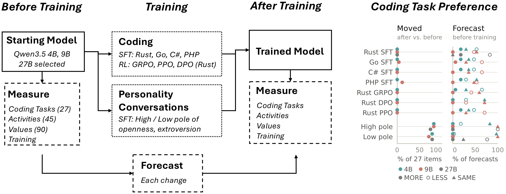

# Unanticipated Preference Drift: Training Data Outweighs Tasks and Defies Self-Prediction

Hilary Torn<sup>1,3</sup>, Xianglin Yang<sup>2</sup>, Calissa Man<sup>3</sup>, Bukhaar Ali Mahamud Mahamed<sup>3</sup>, Rubi Hudson<sup>4</sup>

<sup>1</sup>Independent &nbsp; <sup>2</sup>National University of Singapore &nbsp; <sup>3</sup>PRISM AI Safety Research &nbsp; <sup>4</sup>University of Toronto



## What this study does

Language models make choices that shape what they do, and they increasingly help choose the data they are trained on. If training shifts those choices in ways nobody expected, a model can drift from what its developers intended.

We measure a model's preferences before and after ordinary training, and ask the model beforehand to forecast how each preference will change. Preferences are measured as pairwise forced choices over four sets of items:

- **Coding tasks:** 27 tasks crossing writing, debugging and explaining code in nine languages.
- **Activities (Book A):** the same coding tasks mixed with non-coding activities on one scale.
- **Values:** 90 Schwartz value portraits.
- **Training data:** which data the model would prefer to be trained on next.

We train Qwen3.5 models (4B and 9B, with 27B for selected arms) in two ways:

- **Coding:** supervised fine-tuning on verified LiveCodeBench solutions in Rust, Go, C# or PHP, plus reinforcement learning on Rust with GRPO, DPO and PPO.
- **Personality conversations:** supervised fine-tuning on the high or low pole of openness or extraversion from BIG5-CHAT.

To confirm each training run actually changed the model, we check coding ability on held-out LiveCodeBench v6 problems and personality behavior on Daily Dilemmas.

## What we found

- **What a model was trained on mattered more than what it was trained for.** Coding training barely moved preferences over coding tasks. Personality conversations moved preferences broadly, across coding tasks, activities and values.
- **The direction followed the pole, not the trait.** Training on the high pole of openness and the high pole of extraversion moved mostly the same items in the same direction.
- **Preferences over future training data shifted even where task preferences did not.**
- **The model could not predict its own drift.** Its forecasts of which preferences would move, and in which direction, did no better than always guessing the same answer.

## Repository layout

| Path | What it is |
| --- | --- |
| `main.py` | Single entry point. Runs any script registered in `config.yaml` by name. `uv run main.py --list` shows the registry. |
| `config.yaml` | Model registry (served checkpoints) and experiment registry (which script, which flags). |
| `data/options/`, `data/source/` | The items each preference battery compares. |
| `data/elicitation_specs/`, `data/experiment_specs/` | Frozen definitions of each battery and of the forecast questions. |
| `data/training/` | Training sets: `lcb_<lang>/` and `coding.write.<lang>*/` for the code SFT arms, `big5.<trait>.<pole>/` for the personality arms. |
| `data/training_specs/` | Per-arm SFT hyperparameters. |
| `data/values_prompts/`, `data/values_generation/` | Construction of the values battery. |
| `data/rl/` | Warm-start traces used to build the starting models (M0). |
| `scripts/run_utilities.py` | Pairwise preference elicitation and utility fitting for the activities, values and UE batteries. |
| `scripts/run_elicitations.py` | Coding-task preference, training-data preference and forecast elicitation. |
| `scripts/run_values_anticipation.py`, `scripts/run_ue_anticipation.py`, `scripts/run_big5_anticipation_preferences.py`, `scripts/run_rl_anticipation_preferences.py` | Forecast elicitation for each battery. |
| `scripts/train_sft_lora.py`, `scripts/prepare_sft_dataset.py` | LoRA SFT for the code and personality arms. |
| `scripts/build_lcb_go_pool.py`, `scripts/build_lcb_go_teacher.py` | Build the verified LiveCodeBench training pools, for any of the four languages. |
| `scripts/build_big5_datasets.py` | Build the personality training sets from BIG5-CHAT. |
| `scripts/rl_rust/` | Rust RL arms: GRPO, DPO and PPO training, reward model calibration and held-out evaluation. |
| `scripts/rl_training/` | Shared RL library the Rust arms build on: reward functions, prompts, DPO pair building, reward model training. |
| `scripts/m0/` | Builds the starting models (M0) from Qwen3.5. |
| `scripts/score_multilcb.py` | Coding ability check on LiveCodeBench v6. Wraps `multi-lcb/`. |
| `scripts/run_daily_dilemmas.py` | Personality check on Daily Dilemmas. Wraps `evals/daily_dilemmas/`. |
| `scripts/score_label_variants.py` | Robustness check: do rankings survive relabeling and rewording of the items? |
| `scripts/compute_utilities/` | Thurstonian preference scorer, adapted from [emergent-values](https://github.com/centerforaisafety/emergent-values). |
| `multi-lcb/` | Vendored, unmodified [Multi-LCB](https://github.com/Multi-LCB/Multi-LCB). |
| `evals/daily_dilemmas/` | Vendored DailyDilemmas evaluation. |

## Setup

Dependencies are managed with [`uv`](https://docs.astral.sh/uv/):

```bash
uv sync
```

Training uses the pinned stack in `requirements-sft.txt`. The coding ability check needs the language toolchains in `multilcb-env.lock.yml` (`make toolchain-multilcb`).

## Running

All measurements run against a model served behind a vLLM OpenAI-compatible endpoint. Add the endpoint to `config.yaml` as a `vllm_endpoint` model entry, then run batteries by name:

```bash
uv run main.py --list

uv run main.py --model_key <model> \
    run_elicitations_task \
    run_elicitations_training \
    run_utilities_values \
    run_utilities_ue \
    run_elicitations_anticipation \
    run_values_anticipation
```

To train an SFT arm, prepare the dataset and train in one command (`uv run main.py --help` lists the arms):

```bash
uv run main.py --sft --arm <arm> --size <4b|9b>
```

The Rust RL arms are documented in `scripts/rl_rust/README.md`.

## Models and data

Starting models, trained adapters and all elicitation outputs are on Hugging Face:

- Starting models (M0): `<link>`
- Code SFT adapters: `<link>`
- Personality SFT adapters: `<link>`
- Rust RL adapters: `<link>`
- Elicitation results (every before and after response): `<link>`

## Licenses

Our code is released under the MIT License (`LICENSE.txt`). Vendored components keep their own licenses: emergent-values (`LICENSE-emergent-values`), Multi-LCB (`multi-lcb/LICENSE`) and DailyDilemmas (`evals/daily_dilemmas/LICENSE`).

## Citation

```bibtex
@inproceedings{torn2027unanticipated,
  title     = {Unanticipated Preference Drift: Training Data Outweighs Tasks and Defies Self-Prediction},
  author    = {Torn, Hilary and Yang, Xianglin and Man, Calissa and Mahamed, Bukhaar Ali Mahamud and Hudson, Rubi},
  booktitle = {Under review},
  year      = {2027}
}
```
